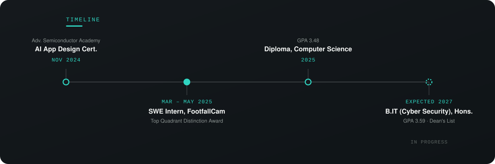

Cybersecurity & IT student in Malaysia, currently finishing a B.IT (Cyber Security) with Honours. Most recently interned at **FootfallCam (Meta Research)**, automating internal tooling and working hands-on with embedded Linux devices in production. Looking for my next internship — happy to talk security, systems, or anything below.

**Portfolio:** UPDATING · **Email:** tayshijye@proton.me · **LinkedIn:** https://www.linkedin.com/in/tayshijye/

 

### Skills

**Security & network ops:** SSH/SFTP · VPN tunneling (GlobalProtect) · port diagnostics · threat intel (PhishTank, Tranco)
**Dev & data:** Python · SQL · REST APIs · Pandas · Streamlit
**Languages:** English (professional) · Mandarin (fluent) · Malay (fluent)

 

### Chronology

 

### Featured projects

| Project | What it does | Stack |
|---|---|---|
| **[chatbot (Emosync)](https://github.com/SJye-118/chatbot)** | Emotion-aware chatbot — [try it live](https://chatbot-c8yerf5mtl4rriuaxqxwru.streamlit.app/) | Python, Streamlit |
| **[PhishGuard](https://github.com/SJye-118/PhishGuard)** | Phishing-detection API pairing explainable ML with forensic intelligence | Python, ML |
| **Trivia Quiz App** | Android quiz app, coursework project — [case study](UPDATING) | Flutter, Dart |

Full write-ups — problem, approach, outcome — are on the [portfolio](UPDATING).

 

### GitHub activity

<table><tr>
<td></td>
<td></td>
</tr></table>
